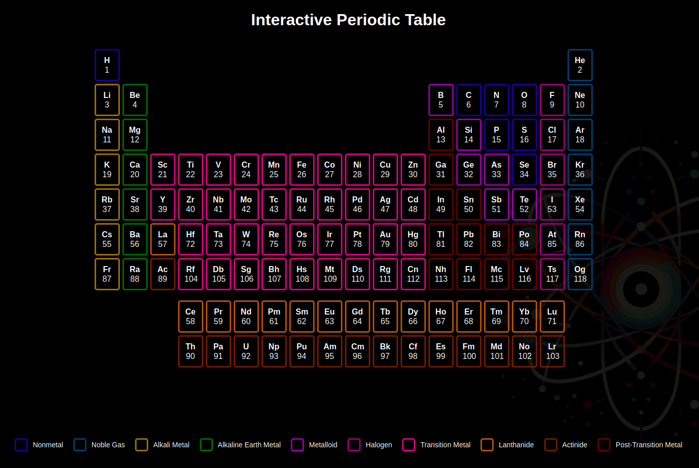
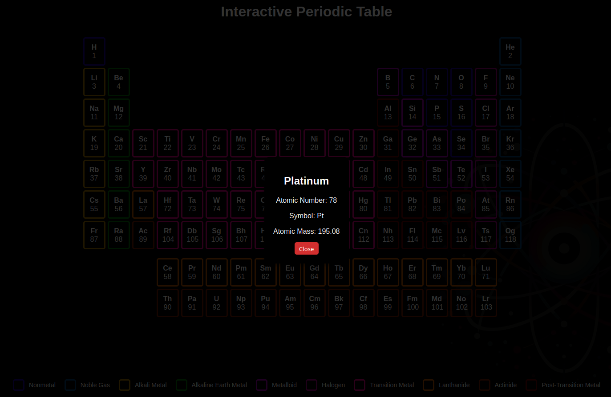

# 🧪 Interactive Periodic Table

Welcome to the **Interactive Periodic Table** project! This web application provides an interactive visualization of the periodic table of elements. Users can hover over elements to see animations, click to view detailed information, and enjoy a sleek dark-themed UI.




## ✨ Features

- **Interactive Design**: Hover over elements to highlight them and display animations.
- **Detailed Information**: Click on an element to view atomic number, mass, symbol, and name in a modal.
- **Dark Theme**: Eye-friendly dark mode with vibrant colors for element groups.
- **Legend**: Clear categorization of element types using a color-coded legend.

## 📂 Project Structure

```
project/
├── index.html
├── style.css
├── README.md
└── LICENSE
```

## 🎨 Dark Theme Design Highlights

- **Background**: Subtle gradients and dark tones for reduced eye strain.
- **Element Groups**: Color-coded groups (e.g., noble gases, alkali metals) for easy recognition.
- **Hover Effects**: Smooth transitions for a modern feel.

## 🚀 How to Use

1. Clone this repository:
   ```bash
   git clone https://github.com/mzums/periodic_table
   ```

2. Open `index.html` in any modern web browser:
   ```bash
   open index.html
   ```

3. Hover over and click elements to interact with the periodic table.

## 🛠️ Technologies Used

- **HTML**: Structure of the application.
- **CSS**: Styling, layout, and dark theme.
- **JavaScript**: Interactive features and modal functionality.

## 📖 Future Enhancements

- 🌐 **Responsive Design**: Improve usability on mobile and tablet devices.
- 🧑‍💻 **Search Functionality**: Add a search bar to locate elements quickly.
- 📊 **Additional Information**: Include electron configurations, melting/boiling points, etc.

## 🎯 Contributing

Contributions are welcome! If you’d like to add features or fix bugs, follow these steps:

1. Fork the repository.
2. Create a new branch:
   ```bash
   git checkout -b feature-name
   ```
3. Commit your changes:
   ```bash
   git commit -m "Add feature-name"
   ```
4. Push the changes:
   ```bash
   git push origin feature-name
   ```
5. Open a pull request.

## 📝 License

This project is open source and available under the [MIT License](LICENSE).

---
Feel free to explore the periodic table and learn more about the elements! 🌍

